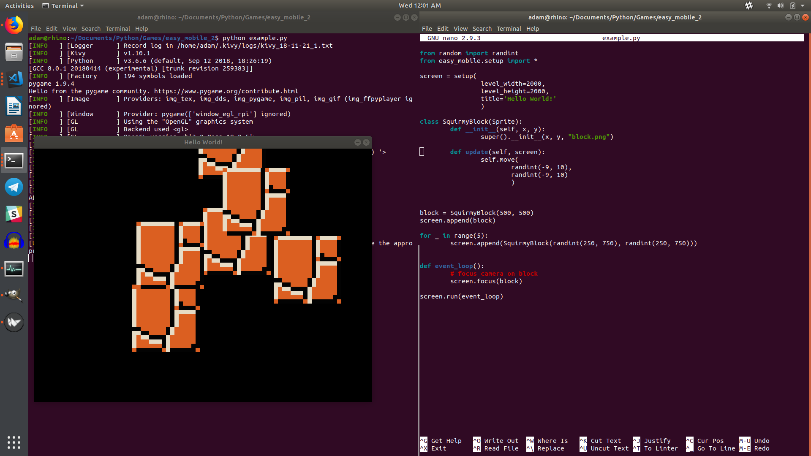

# easy_mobile_2
Version 2 of Easy Mobile. Runs on Linux, Mac, Windows, Android, and iOS.

## Installation
Install Python 2 or 3, install Kivy, clone this repository and run the example.

## Screenshot of example

